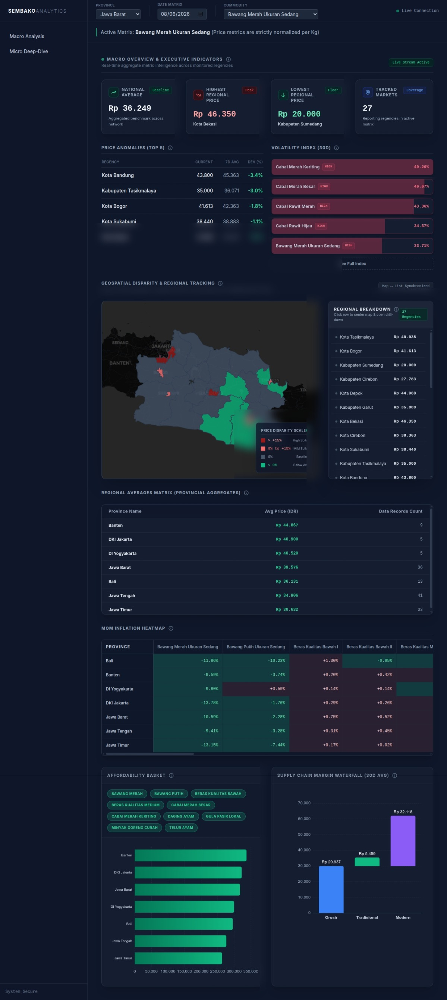
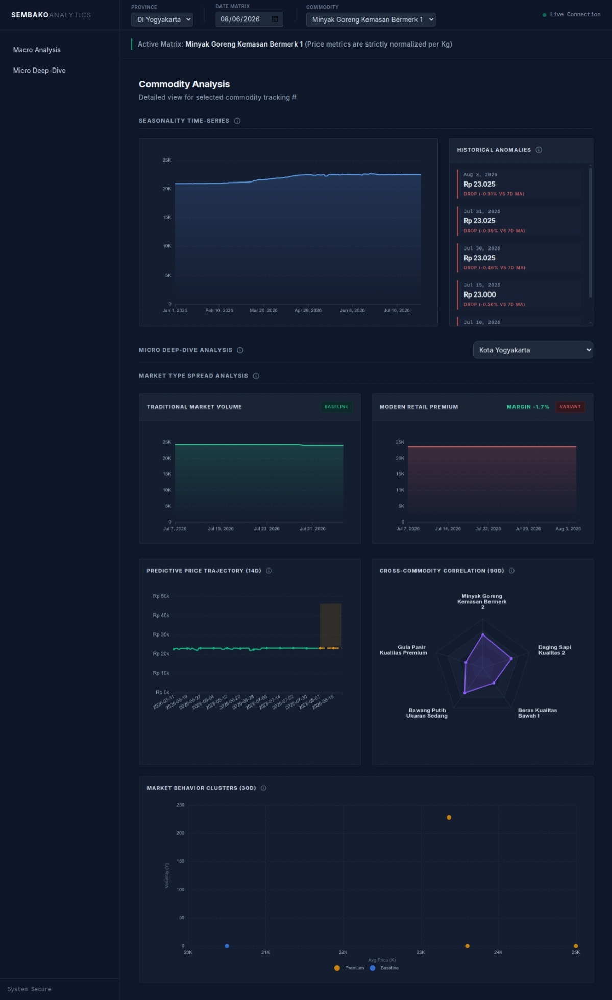

# Sembako Analytics Dashboard


## 📖 Project Overview



The **Sembako Analytics Dashboard** is a Full-Stack Data App designed for National Food Commodity Price Tracking & Analytics. This powerful platform transforms raw, nationwide market data into actionable insights—allowing stakeholders, policymakers, and data scientists to continuously monitor food inflation, anticipate market volatility, and uncover deep supply chain disparities across Indonesia in real-time. By bridging macroeconomic overviews with granular micro-level deep-dives, it serves as the ultimate analytical engine for food security and price stabilization.

---

## 🏗️ System Architecture & Upstream Data Pipeline

To guarantee high scalability and separation of concerns, this project strictly separates **Data Ingestion** from **Data Consumption**.

The current repository focuses solely on Data Consumption (Analytics APIs and UI). The raw data extraction, dimension table seeding, and the daily Luigi ETL (Extract, Transform, Load) pipelines are handled in an isolated upstream repository. This ensures that heavy database write operations do not interfere with the high-performance read requirements of the dashboard.

> **🔗 Upstream Repository:**  
> For the complete ETL process and Data Warehouse generation, please refer to our upstream pipeline repository: **[Simple Data Eng Sembako Price](https://github.com/akhmadtaufik/simple-data-eng-sembako-price)**.

---

## ✨ Key Features

### 🌍 Macro Analysis (National Overview)
- **Geospatial Choropleth Map:** Interactive Leaflet map (optimized with Vue's `markRaw` for high performance) visualizing provincial price disparities against the national baseline.
- **30D Volatility Index:** A normalized risk metric using the Coefficient of Variation (CV) to rank commodities with the highest price instability.
- **MoM Inflation Heatmap:** Month-over-Month percentage differences tracking structural inflation across provinces and commodities.

### 🔍 Micro Deep-Dive Analysis (Granular Insights)


- **Market Behavior Clusters:** Segments localized markets into distinct risk clusters using Scikit-Learn's K-Means clustering ($k=3$) and Statistical Binning based on 30-day mean price and standard deviation.
- **Predictive Price Trajectory:** Forecasts the next 14 days of commodity prices using a Degree-1 Polynomial Fit (Linear Regression) with an expanding 2%-5% uncertainty confidence interval.
- **Cross-Commodity Correlation:** Identifies substitute and complementary goods automatically by computing a Pearson Correlation Coefficient matrix across 90-day price trends.
- **Market Type Spread Analysis:** Tracks structural supply chain inflation by dynamically calculating the margin percentage premium between Modern Retailers (Variant) and Traditional Markets (Baseline).

---

## 🛠️ Tech Stack

| Domain | Technologies |
| :--- | :--- |
| **Frontend** | Vue 3 (Composition API), Tailwind CSS, ECharts, Leaflet, Vite |
| **Backend** | FastAPI, Python 3, Pydantic (V2), SQLAlchemy, Scikit-learn, Pandas, NumPy |
| **Data Warehouse** | PostgreSQL |
| **Infrastructure** | Docker, Docker Compose, Redis |

---

## 🔗 API Reference & Master Data Flow

The Sembako Analytics engine enforces a strict separation between **Master Data (Static Dimensions)** and **Analytical Data (Dynamic Facts)**. 

> **⚠️ CRITICAL ARCHITECTURAL RULE:** Clients **MUST NOT** use string names (e.g., `"DKI Jakarta"`, `"Beras Medium"`) to query the Analytics endpoints. 

You must strictly adhere to this two-step workflow to guarantee data integrity:
1. **Step 1: Fetch Static IDs.** Call the Master Data endpoints (`/api/v1/locations/provinces`, `/api/v1/commodities/items`) to fetch the fixed, read-only IDs.
2. **Step 2: Feed IDs into Analytics.** Pass the retrieved IDs as query parameters into the `/analytics` endpoints.

**Example Data Flow:**
```http
# 1. Fetch Commodity ID for "Beras Medium" -> returns commodity_id=1
GET /api/v1/commodities/items

# 2. Fetch Province ID for "DKI Jakarta" -> returns province_id=31
GET /api/v1/locations/provinces

# 3. Request Volatility Analytics using the static IDs
GET /api/v1/analytics/volatility?commodity_id=1&province_id=31
```
*For detailed mathematical methodologies, see [docs/API-Reference.md](docs/API-Reference.md).*

---

## 🚀 Getting Started / Installation

### Prerequisites
- Docker & Docker Compose
- Node.js 18+ (for local frontend development)
- Python 3.10+ (for local backend development)

### 1. Environment Configuration
Create a `.env` file in the root directory by copying the provided example template:

```bash
cp .env.example .env
```
Ensure you update the dummy values in your new `.env` file with your actual database credentials and API keys.

### 2. Run with Docker Compose
The easiest way to spin up the entire Full-Stack environment (Backend, Frontend, Redis) is via Docker Compose:

```bash
# Build and start all services in detached mode
docker compose up --build -d

# Check the logs of the running containers
docker compose logs -f
```
Once running, access the dashboard at: **`http://localhost:5174`** (or your configured `FRONTEND_HOST_PORT`).  
Access the Interactive API Swagger Docs at: **`http://localhost:8080/docs`**.

---

## 💻 Development & Scripts

If you prefer to run the services locally (outside of Docker) for active development:

### Backend Development (FastAPI)
```bash
cd backend

# Create and activate virtual environment
python -m venv venv
source venv/bin/activate  # On Windows: venv\Scripts\activate

# Install dependencies
pip install -r requirements.txt

# Run the Uvicorn development server
uvicorn app.main:app --host 0.0.0.0 --port 8080 --reload
```

### Frontend Development (Vue 3)
```bash
cd frontend

# Install dependencies
npm install

# Run the Vite development server
npm run dev

# Build for production
npm run build
```

---
*Developed with ❤️ for National Food Security and Data Transparency.*
